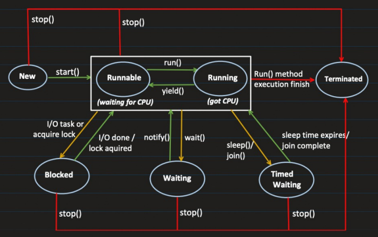

# Multithreading and Concurrency

## Process
- Process is an instance of a program that is getting executed.
- It has its own resource like memory, thread, etc. OS allocate these resources to process when it's created.
- Compilation (java Test.java): generated bytecode that can be executed by JVM
  - Execution (java Test): at this point, JVM starts the new process, here Test is the class which has `public static void main(String args[])` method.

### How much memory does process gets?
- While creating the process "java MainclassName" 

## Thread
- Thread is a known as lightweight process.
- Smallest sequence of instructions that are executed by CPU independently and 1 process can have multiple threads.
- When a process is created, it starts with 1 thread and that initial thread known as 'main thread' and from that we can create multiple threads to perform task concurrently.
  ```java
  public class MultithreadingLearing {
    public static void main(String args[]) {
        System.out.println("Thread Name: " + Thread.currentThread().getName());
        //Output -- Thread Name: main
    }
  }
  ```

## Understanding Process and Threads in Depth
- When the compiler comes to main
  - A new process is created
  - A new instance of JVM is created
-  
- 
- Code Segment, Data Segment and Heap Memory is shared with all thread.
- Register, Stack and Counter is local to each thread.

### Code Segment
- Contains the compiled **BYTECODE** (machine code) of the Java program.
- Its read only.
- All threads are within the same process, they share the same code segment.

### Data Segment
- Contains the **GLOBAL** and **STATIC** variables.
- All threads are within the same process, they share the same data segment.
- Threads can read and modify the same data.
- Synchronization is required between multiple threads.

### Heap
- Objects created at runtime using "new" keyword are allocated in the heap.
- Heap is shared among all the threads of the same process. (but NOT WITHIN PROCESS)
  - Let's say in Process1, X8000 heap memory pointing to some location in physical memory, some X8000 heap memory point to different location for Process2)
- Threads can read and modify the heap data.
- Synchronization is required between multiple threads.

### Stack
- Each thread has its own STACK.
- It manages, method calls, local variables.

### Register
- When JIT (Just-In-Time) compiles **converts the Bytecode into native machine code**, its uses register to **optimize the generated machine code**.
- Also helps in **context switching**.
- Each thread has its own Register.

### Counter
- Also known as **Program Counter**, it points to the instruction which is getting executed.
- Increments its counter after successfull execution of the instruction.

All these are managed by JVM.

## Multithreading
- Allows a program to perform multiple operations at the same time.
- Multiple threads share the same resource such as memory space but still can perform task independently.

### Benefits and Challenges of Multithreading
#### Benefits
- Improved performance by task parallelism
- Responsiveness
- Resource sharing

### Challenges
- Concurrency issue like deadlock, data inconsistency etc.
- Synchronized overhead.
- Testing and debugging is difficult.

## Ways to Create a Thread
- implementing "Runnable" interface
- extending "Thread" class

### Creating a Thread using Runnable Interface
#### Step 1: Create a Runnable Object
- Create a class that implements 'Runnable' Interface.
- Implement the 'run()' method to tell the task which thread has to do.
  ```java
  public class MultithreadingLearning implements Runnable {
    @Override
    public void run() {
        System.out.println("Code executed by thread: " + Thread.currentThread().getName());
    }
  }
  ```
#### Step 2: Start the Thread
- Create an instance of class that implement 'Runnable'
- Pass the Runnable object to the Thread Constructor
- Start the thread
  ```java
  public class Main {
    public static void main(String[] args) {
        System.out.println("Going inside main method: " + Thread.currentThread().getName());
        MultithreadingLearning runnableObj = new MultithreadingLearning();
        Thread thread = new Thread(runnableObj);
        thread.start();
        System.out.println("Finish main method: " + Thread.currentThread().getName());
    }
  }
  ```
#### Output  
```
Going inside main method: main
Finish main method: main
code executed by thread: Thread-0
```

### Creating a Thread by extending Thread Class
#### Step 1: Create a Thread Subclass
- Create a class that extends 'Thread' class.
- Override the 'run()' method to tell the task which thread has to do.
  ```java
  public class MultithreadingLearning extends Thread {
    @Override
    public void run() {
        System.out.println("Code Executed by Thread: " + Thread.currentThread().getName());
    }
  }
  ```
  
#### Step 2: Initiate and Start the Thread
- Create an instance of the subclass
- Call the start() method to begin this execution
  ```java
  public class Main {
    public static void main(String[] args) {
        System.out.println("Going inside main method: " + Thread.currentThread().getName());
        MultithreadingLearning myThread = new MultithreadingLearning();
        myThread.start();
        System.out.println("Finish main method: " + Thread.currentThread().getName());
    }
  }
  ```
  
#### Output
```
Going inside main method: main
Finish main method: main
Code Executed by Thread: Thread-0
```

### Why we have two ways to create threads?
- A class can implement more than 1 interface
- A class can extend only 1 class

## Thread Lifecycle


| Lifecycle State | Description                                                                                                                                                                                                                                                                        |
|-----------------|------------------------------------------------------------------------------------------------------------------------------------------------------------------------------------------------------------------------------------------------------------------------------------|
| New | a. Thread has been created but not started <br> b. Its just an Object in memory.                                                                                                                                                                                                   |
| Runnable | a. Thread is ready to run. b. Waiting for CPU time.                                                                                                                                                                                                                                |
| Running | When thread start executing its code.                                                                                                                                                                                                                                              |
| Blocked | a. Different scenarios where runnable thread goes into the blocking state: <br> i. I/O: like reading from a file or database. <br> ii. Lock required: If thread want to lock on a resource which is locked by other thread, it has to wait. <br> b. Releases all the MONITOR LOCKS |
| Waiting | a. Thread goes into this state when we call the wait() method, makes it not runnable. <br> b. Its goes back to runnable, once we call notify() or notifyAll() method. <br> c. Releases all the MONITOR LOCK.                                                                       |
| Timed Waiting | a. Thread waits for specific period of time and comes back to runnable state, after specific conditions met, like sleep(), join(). <br> b. Do not releases any MONITOR LOCKS |
| Terminated | Life of thread is completed, it cannot be started back again. |

Before seeing an example, lets first understand "MONITOR LOCK"

### MONITOR LOCK
It helps to make sure that only 1 thread goes inside the particular section of code (a synchronized block or method)

```java
public class MonitorLockExample {
    public synchronized void task1() {
      //do something
      try {
          System.out.println("Inside Task 1");
          Thread.sleep(10000);
      } catch (Exception e) {
          //exception handling here
      }
    }
    
    public void task2() {
        System.out.println("Task 2, but before synchronized");
        synchronized (this) {
            System.out.println("Task 2, Inside Synchronized");
        }
    }
    
    public void task3() {
        System.out.println("Task 3");
    }
}
```

```java
public static void main(String args[]) {
    MonitorLockExample obj = new MonitorLockExample();
    Thread t1 = new Thread(() -> obj.task1());
    Thread t2 = new Thread(() -> obj.task2());
    Thread t3 = new Thread(() -> obj.task3());
    
    t1.start();
    t2.start();
    t3.start();
}
```

#### Example
```java
public class SharedResource {
    boolean itemAvailable = false;
    //synchronized put the monitor lock
    public synchronized void addItem() {
        itemAvailable = true;
        System.out.println("Item added by: " + Thread.currentThread().getName() + " and invoking all threads which are waiting");
        notifyAll();
    }
    
    public synchronized void consumeItem() {
        System.out.println("ConsumeItem method invoked by: " + Thread.currentThread().getName());
        //using while loop to avoid "spurious wake-up", sometimes because of system noise
        while(itemAvailable) {
            try {
                System.out.println("Thread " + Thread.currentThread().getName() + " is waiting now.");
            } catch (Exception e) {
                //handle exception here
            }
        }
      System.out.println("Item Consumed By: " + Thread.currentThread().getName());
      itemAvailable = false;
    }
}
```

```java
public class ProduceTask implements Runnable {
    SharedResource sharedResource;
    
    ProduceTask(SharedResource resource) {
        this.sharedResource = resource;
    }
    
    @Override
    public void run() {
        System.out.println("Producer Thread: " + Thread.currentThread().getName());
        try {   
            Thread.sleep(5000);
        } catch (Exception e) {
            //handle any exception here
        }
        sharedResource.addItem();
    }
}
```

```java
public class ConsumeTask implements Runnable {
    SharedResource sharedResource;
    
    ConsumeTask(SharedResource resource) {
        this.sharedResource = resource;
    }
    
    @Override
    public void run() {
        System.out.println("Consumer thread: " + Thread.currentThread().getName());
        sharedResource.consumeItem();
    }
}
```

```java
public class Main {
    public static void main(String[] args) {
        System.out.println("Main method start");
        SharedResource sharedResource = new SharedResource();
        //producer thread
        Thread producerThread = new Thread(new ProduceTask(sharedResource));
        //consumer thread
        Thread consumerThread = new Thread(new ConsumeTask(sharedResource));
        //thread is in "RUNNABLE state"
        producerThread.start();
        consumerThread.start();
        
        System.out.println("Main method end");
    }
}
```

Or use Lambda Expression, instead of creating ProduceTask and ConsumeTask class
```java
Thread consumerThread = new Thread(() -> {
   System.out.println("Consumer Thread: " + Thread.currentThread().getName());
   sharedResource.consumeItem();
});
```