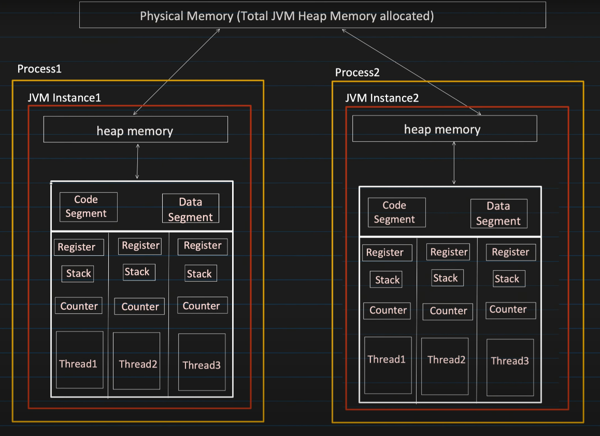
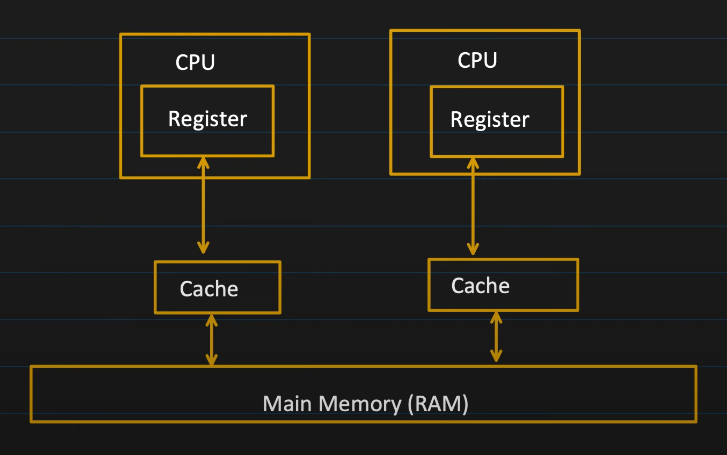

# Multithreading and Concurrency

## Process
- Process is an instance of a program that is getting executed.
- It has its own resource like memory, thread, etc. OS allocate these resources to process when it's created.
- Compilation (java Test.java): generated bytecode that can be executed by JVM
  - Execution (java Test): at this point, JVM starts the new process, here Test is the class which has `public static void main(String args[])` method.

### How much memory does process gets?
- While creating the process "java MainclassName" 

## Thread
- Thread is a known as lightweight process.
- Smallest sequence of instructions that are executed by CPU independently and 1 process can have multiple threads.
- When a process is created, it starts with 1 thread and that initial thread known as 'main thread' and from that we can create multiple threads to perform task concurrently.
  ```java
  public class MultithreadingLearing {
    public static void main(String args[]) {
        System.out.println("Thread Name: " + Thread.currentThread().getName());
        //Output -- Thread Name: main
    }
  }
  ```

## Understanding Process and Threads in Depth
- When the compiler comes to main
  - A new process is created
  - A new instance of JVM is created
-  
- 
- Code Segment, Data Segment and Heap Memory is shared with all thread.
- Register, Stack and Counter is local to each thread.

### Code Segment
- Contains the compiled **BYTECODE** (machine code) of the Java program.
- Its read only.
- All threads are within the same process, they share the same code segment.

### Data Segment
- Contains the **GLOBAL** and **STATIC** variables.
- All threads are within the same process, they share the same data segment.
- Threads can read and modify the same data.
- Synchronization is required between multiple threads.

### Heap
- Objects created at runtime using "new" keyword are allocated in the heap.
- Heap is shared among all the threads of the same process. (but NOT WITHIN PROCESS)
  - Let's say in Process1, X8000 heap memory pointing to some location in physical memory, some X8000 heap memory point to different location for Process2)
- Threads can read and modify the heap data.
- Synchronization is required between multiple threads.

### Stack
- Each thread has its own STACK.
- It manages, method calls, local variables.

### Register
- When JIT (Just-In-Time) compiles **converts the Bytecode into native machine code**, its uses register to **optimize the generated machine code**.
- Also helps in **context switching**.
- Each thread has its own Register.

### Counter
- Also known as **Program Counter**, it points to the instruction which is getting executed.
- Increments its counter after successfull execution of the instruction.

All these are managed by JVM.

## Multithreading
- Allows a program to perform multiple operations at the same time.
- Multiple threads share the same resource such as memory space but still can perform task independently.

### Benefits and Challenges of Multithreading
#### Benefits
- Improved performance by task parallelism
- Responsiveness
- Resource sharing

### Challenges
- Concurrency issue like deadlock, data inconsistency etc.
- Synchronized overhead.
- Testing and debugging is difficult.

### Multitasking vs Multithreading
